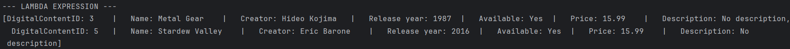
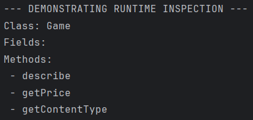

# Digital Store API - Milestone 2
## SOLID Architecture & Advanced OOP Features

## Project Overview

This project is a **refactored version** of the Digital Store API, now implementing SOLID principles and advanced Java features. The system demonstrates professional-grade software architecture for a digital marketplace where users purchase various types of digital content (games, movies, music albums).

**Key Improvements in Milestone 2:**
- Applied all five SOLID principles
- Introduced generics for type-safe repositories
- Implemented lambda expressions for functional operations
- Added reflection utilities for runtime inspection
- Enhanced interfaces with default and static methods
- Strengthened layer separation and dependency management

### Technology Stack
- **Language:** Java 17+
- **Database:** PostgreSQL
- **Architecture:** Multi-layer (Controller → Service → Repository → Database)
- **Design Patterns:** Repository Pattern, Dependency Injection

---

## SOLID Principles Applied

### Single Responsibility Principle (SRP)
*Each class has one, and only one, reason to change.*

**UserService**
- **Responsibility:** User business logic and validation
- **Does NOT:** Execute SQL queries, handle UI, manage other entities
- **Example:** Validates email format, checks for duplicate users, enforces business rules

**UserRepository**
- **Responsibility:** Database operations for User entity only
- **Does NOT:** Validate data, implement business rules
- **Example:** Executes CRUD SQL statements using JDBC

**GameService**
- **Responsibility:** Game-specific business logic and validation
- **Does NOT:** Directly access database, handle UI
- **Example:** Ensures creator exists before creating game, validates game fields

**Main (Controller)**
- **Responsibility:** User interaction and coordination
- **Does NOT:** Validate input, execute SQL, implement business logic
- **Example:** Displays menu, captures user input, delegates to services

**PurchaseService**
- **Responsibility:** Purchase transaction logic
- **Does NOT:** Manage users or content directly
- **Example:** Prevents duplicate purchases, validates purchase data

**Why this matters:** When email validation logic needs to change, we only modify `UserService`. When database structure changes, we only modify repositories. Each class has clear, focused responsibilities.

---

### Open/Closed Principle (OCP)
*Classes should be open for extension but closed for modification.*

**DigitalContent Abstract Class**

Our `DigitalContent` class demonstrates OCP:

```java
public abstract class DigitalContent {
    protected int id;
    protected String name;
    protected Creator creator;
    protected int releaseYear;
    protected boolean available;
    
    public abstract String describe();
    public abstract String getContentType();
}
```

**Current implementations:**
- `Game` - adds gaming-specific fields
- `Movie` - adds cinematic fields
- `MusicAlbum` - adds music-specific fields

**Future extensibility (without modifying DigitalContent):**
```java
// We can add new content types WITHOUT changing the base class
public class Podcast extends DigitalContent {
    private int episodeCount;
    
    @Override
    public String describe() {
        return "Podcast: " + name;
    }
    
    @Override
    public String getContentType() {
        return "podcast";
    }
}

public class Audiobook extends DigitalContent {
    private String narrator;
    private int duration;
    // ... implementation
}
```

**Polymorphic usage remains unchanged:**
```java
// This code works for Game, Movie, MusicAlbum, and any future subtypes
List<DigitalContent> allContent = new ArrayList<>();
allContent.addAll(gameService.getAllGames());
allContent.addAll(movieService.getAllMovies());
// Works immediately with Podcast, Audiobook, etc.

for (DigitalContent content : allContent) {
    System.out.println(content.describe()); // Polymorphic call
}
```

**Why this matters:** We can add new digital content types (e-books, software, podcasts) without modifying existing, tested code. The system is extensible without being fragile.

---

### Liskov Substitution Principle (LSP)
*Subclasses should be substitutable for their base class without altering program correctness.*

**Demonstration in polymorphismDemo():**

```java
private static void polymorphismDemo() {
    // All subclasses can be treated as DigitalContent
    List<DigitalContent> content = new ArrayList<>();
    content.addAll(gameService.getAllGames());      // Game → DigitalContent ✓
    content.addAll(movieService.getAllMovies());     // Movie → DigitalContent ✓
    content.addAll(musicAlbumService.getAllMusicAlbums()); // MusicAlbum → DigitalContent ✓
    
    // All objects behave correctly through base class reference
    for (DigitalContent dc : content) {
        System.out.println(dc.describe()); // Each subclass provides correct behavior
    }
}
```

**Why LSP is satisfied:**
1. **Game, Movie, MusicAlbum** can replace `DigitalContent` in any context
2. All override `describe()` appropriately
3. All maintain the contract defined by `DigitalContent`
4. No subclass breaks expectations of the base class

**Counter-example (LSP violation):**
```java
// BAD - Violates LSP
public class FreeContent extends DigitalContent {
    @Override
    public double getPrice() {
        throw new UnsupportedOperationException("Free content has no price!");
    }
}
// This breaks code expecting all DigitalContent to have a price
```

**Our implementation avoids this** - all subclasses maintain consistent behavior.

---

### Interface Segregation Principle (ISP)
*Clients should not be forced to depend on interfaces they don't use.*

**Our focused interfaces:**

**1. CrudRepository<T> Interface**
```java
public interface CrudRepository<T> {
    void create(T entity);
    List<T> getAll();
    T getById(Integer id);
    void update(Integer id, T entity);
    void delete(Integer id);
}
```
- **Purpose:** Only CRUD operations
- **Implemented by:** UserRepository, CreatorRepository, GameRepository, etc.
- **Does NOT include:** Validation, business logic, printing, serialization

**2. Validate Interface**
```java
public interface Validate {
    void validate();
    
    default boolean isValid() {
        try {
            validate();
            return true;
        } catch (RuntimeException e) {
            return false;
        }
    }
    
    static void validateAll(List<? extends Validate> items) {
        items.forEach(Validate::validate);
    }
}
```
- **Purpose:** Only validation logic
- **Implemented by:** User, Creator, Game, Movie, MusicAlbum, Purchase
- **Does NOT include:** Database operations, business logic

**Why ISP matters:**

**Bad approach (violates ISP):**
```java
// ANTI-PATTERN: Fat interface
interface EntityOperations<T> {
    void create(T entity);
    void validate(T entity);
    void print(T entity);
    void export(T entity);
    void audit(T entity);
    void cache(T entity);
}
// Repository forced to implement print, export, audit, cache even if not needed!
```

**Our approach (follows ISP):**
- Repositories only implement `CrudRepository<T>` (no validation, printing)
- Models only implement `Validate` (no database logic)
- Each class implements only the interfaces it actually needs
- Smaller, focused interfaces are easier to implement and test

---

### Dependency Inversion Principle (DIP)
*High-level modules should depend on abstractions, not concretions.*

**NOTE:** *To fully satisfy DIP, your services should use interface types in constructors. Currently, if you're using concrete classes like `GameRepository`, you need to change them to `CrudRepository<Game>`.*

**Current implementation (needs DIP improvement):**
```java
// In GameService.java
public class GameService {
    private final GameRepository repository; // ❌ Depends on concrete class
    
    public GameService(CreatorService creatorService, GameRepository repository) {
        this.repository = repository;
    }
}
```

**DIP-compliant implementation (REQUIRED):**
```java
// In GameService.java  
public class GameService {
    private final CrudRepository<Game> repository; // ✓ Depends on interface (abstraction)
    
    public GameService(CreatorService creatorService, CrudRepository<Game> repository) {
        this.repository = repository;
    }
}
```

**In Main.java:**
```java
private static void initServices() {
    // Create concrete implementations
    CrudRepository<User> userRepo = new UserRepository();
    CrudRepository<Creator> creatorRepo = new CreatorRepository();
    CrudRepository<Game> gameRepo = new GameRepository();
    
    // Inject abstractions (interfaces), not concretions
    userService = new UserService(userRepo);
    creatorService = new CreatorService(creatorRepo);
    gameService = new GameService(creatorService, gameRepo);
    // ...
}
```

**Benefits of DIP:**

1. **Testability:** Can inject mock repositories for testing
```java
// In tests
CrudRepository<Game> mockRepo = new MockGameRepository();
GameService service = new GameService(creatorService, mockRepo);
// Test without real database!
```

2. **Flexibility:** Can swap implementations without changing service code
```java
// Switch to in-memory repository
CrudRepository<Game> inMemoryRepo = new InMemoryGameRepository();
GameService service = new GameService(creatorService, inMemoryRepo);
```

3. **Loose coupling:** Services don't depend on database implementation details

**Architecture diagram:**
```
Controller (Main)
    ↓ depends on
Service Layer (uses interfaces)
    ↓ depends on  
Repository Interfaces (CrudRepository<T>)
    ↑ implemented by
Repository Implementations (GameRepository, etc.)
    ↓ depends on
Database (PostgreSQL)
```

High-level (Service) depends on abstraction (CrudRepository interface), not low-level (GameRepository class).

---

## Advanced OOP Features

### Generics

**1. Generic CrudRepository Interface**

```java
public interface CrudRepository<T> {
    void create(T entity);
    List<T> getAll();
    T getById(Integer id);
    void update(Integer id, T entity);
    void delete(Integer id);
}
```

**Benefits:**
- **Type safety:** Compiler prevents wrong types
- **Code reuse:** One interface for all entities
- **No casting:** `T getById(Integer id)` returns correct type

**Usage examples:**
```java
// Type-safe repositories
CrudRepository<Game> gameRepo = new GameRepository();
CrudRepository<User> userRepo = new UserRepository();

Game game = gameRepo.getById(1);      // Returns Game, not Object
User user = userRepo.getById(1);      // Returns User, not Object
// No casting needed!
```

**2. Generic Sorting Utility**

```java
public class SortingUtil {
    public static <T> void sort(List<T> items, Comparator<T> comparator) {
        items.sort(comparator);
    }
    
    public static <T> List<T> sortedCopy(List<T> items, Comparator<T> comparator) {
        return items.stream()
                .sorted(comparator)
                .toList();
    }
}
```

**Benefits:**
- Works with any type `T`
- Type-safe comparisons
- Reusable across all entities

**Usage:**
```java
// Sort games by release year
List<Game> sortedGames = SortingUtil.sortedCopy(
    gameService.getAllGames(),
    Comparator.comparingInt(Game::getReleaseYear)
);

// Sort users by name
List<User> sortedUsers = SortingUtil.sortedCopy(
    userService.getAllUsers(),
    Comparator.comparing(User::getName)
);
```

**3. Wildcard Generics in Validate Interface**

```java
static void validateAll(List<? extends Validate> items) {
    items.forEach(Validate::validate);
}
```

**Benefits:**
- Accepts lists of any type that implements `Validate`
- Type-safe iteration
- Demonstrates bounded wildcards

---

### Lambda Expressions

**1. Sorting with Lambda (in lambdaDemo())**

```java
private static void lambdaDemo() {
    List<Game> games = gameService.getAllGames();
    
    // Lambda expression for comparison
    List<Game> sortedByYear = SortingUtil.sortedCopy(
        games,
        Comparator.comparingInt(Game::getReleaseYear) // Method reference (lambda)
    );
    
    System.out.println("Games sorted by release year:");
    sortedByYear.forEach(g -> System.out.println(g.getReleaseYear() + ": " + g.getName()));
    
    // Sort by name
    List<Game> sortedByName = SortingUtil.sortedCopy(
        games,
        (g1, g2) -> g1.getName().compareTo(g2.getName()) // Lambda expression
    );
    
    System.out.println("\nGames sorted alphabetically:");
    sortedByName.forEach(System.out::println); // Method reference
}
```

**2. Filtering with Lambda**

```java
// Filter available content
List<Game> availableGames = games.stream()
    .filter(g -> g.isAvailable()) // Lambda predicate
    .collect(Collectors.toList());
```

**3. forEach with Lambda (in readDemo())**

```java
gameService.getAllGames().forEach(game -> System.out.println(game.describe()));
```

**Benefits of lambdas:**
- Concise, readable code
- Functional programming style
- Eliminates boilerplate
- Enables stream operations

---

### Reflection (Runtime Type Information)

**ReflectionUtil Class:**

```java
public class ReflectionUtil {
    public static void inspect(Object obj) {
        Class<?> clazz = obj.getClass();
        
        System.out.println("=== Runtime Inspection ===");
        System.out.println("Class Name: " + clazz.getName());
        System.out.println("Simple Name: " + clazz.getSimpleName());
        System.out.println("Package: " + clazz.getPackageName());
        
        System.out.println("\nFields:");
        for (Field field : clazz.getDeclaredFields()) {
            System.out.printf("  %s %s%n", 
                field.getType().getSimpleName(), 
                field.getName());
        }
        
        System.out.println("\nMethods:");
        for (Method method : clazz.getDeclaredMethods()) {
            System.out.printf("  %s %s()%n",
                method.getReturnType().getSimpleName(),
                method.getName());
        }
        
        System.out.println("\nSuperclass: " + clazz.getSuperclass().getSimpleName());
        
        System.out.println("\nInterfaces:");
        for (Class<?> iface : clazz.getInterfaces()) {
            System.out.println("  - " + iface.getSimpleName());
        }
    }
}
```

**Usage in reflectionDemo():**
```java
private static void reflectionDemo() {
    DigitalContent content = gameService.getAllGames().getFirst();
    ReflectionUtil.inspect(content);
}
```

**Example Output:**
```
=== Runtime Inspection ===
Class Name: model.Game
Simple Name: Game
Package: model

Fields:
  double price
  String genre
  int players

Methods:
  String describe()
  String getContentType()
  double getPrice()

Superclass: DigitalContent

Interfaces:
  - Validate
```

**Use cases for reflection:**
- Debugging and logging
- ORM frameworks (Hibernate)
- Dependency injection (Spring)
- Testing frameworks (JUnit)
- Serialization/deserialization

---

### Interface Default and Static Methods

**Validate Interface:**

```java
public interface Validate {
    // Abstract method (must be implemented)
    void validate();
    
    // DEFAULT METHOD - provides implementation, can be overridden
    default boolean isValid() {
        try {
            validate();
            return true;
        } catch (RuntimeException e) {
            return false;
        }
    }
    
    // STATIC METHOD - utility method in interface
    static void validateAll(List<? extends Validate> items) {
        items.forEach(Validate::validate);
    }
}
```

**Benefits of default methods:**
- Add methods to interfaces without breaking existing implementations
- Provide common behavior
- Can be overridden if needed

**Usage of default method:**
```java
User user = new User("John", "john@email.com");
if (user.isValid()) {
    userService.createUser(user);
} else {
    System.out.println("Invalid user data");
}
```

**Benefits of static methods:**
- Utility methods related to interface
- No need for separate utility class
- Clear association with interface

**Usage of static method:**
```java
List<Validate> entities = Arrays.asList(user1, user2, game1, movie1);
Validate.validateAll(entities); // Validates all at once
```

**Why this matters:**
- Before Java 8, adding methods to interfaces broke all implementations
- Default methods allow interface evolution
- Static methods provide related utilities without helper classes

---

## OOP Design Documentation

### Abstract Class and Subclasses

**Abstract Base Class: DigitalContent**

```java
public abstract class DigitalContent implements Validate {
    protected int id;
    protected String name;
    protected Creator creator;
    protected int releaseYear;
    protected boolean available;
    
    // Abstract methods (must be implemented by subclasses)
    public abstract String describe();
    public abstract String getContentType();
    
    // Concrete methods (inherited by all subclasses)
    public void changeAvailability() {
        this.available = !this.available;
    }
    
    public double calculateDiscountedPrice(double discountPercent) {
        return this.getPrice() * (1 - discountPercent / 100);
    }
    
    // Getters, setters...
}
```

**Subclass 1: Game**

```java
public class Game extends DigitalContent {
    private double price;
    private String genre;
    private int maxPlayers;
    
    @Override
    public String describe() {
        return String.format("Game: %s (%d) by %s - Genre: %s, Players: %d, $%.2f",
            name, releaseYear, creator.getName(), genre, maxPlayers, price);
    }
    
    @Override
    public String getContentType() {
        return "game";
    }
    
    @Override
    public void validate() {
        if (name == null || name.trim().isEmpty()) {
            throw new InvalidInputException("Game name cannot be empty");
        }
        if (price <= 0) {
            throw new InvalidInputException("Price must be positive");
        }
    }
}
```

**Subclass 2: Movie**

```java
public class Movie extends DigitalContent {
    private boolean isOriginal;
    private int duration;
    
    @Override
    public String describe() {
        return String.format("Movie: %s (%d) by %s - Duration: %d min",
            name, releaseYear, creator.getName(), duration);
    }
    
    @Override
    public String getContentType() {
        return "movie";
    }
}
```

**Subclass 3: MusicAlbum**

```java
public class MusicAlbum extends DigitalContent {
    private int trackCount;
    
    @Override
    public String describe() {
        return String.format("Album: %s (%d) by %s - Tracks: %d",
            name, releaseYear, creator.getName(), trackCount);
    }
    
    @Override
    public String getContentType() {
        return "music_album";
    }
}
```

---

### Composition and Aggregation

**1. DigitalContent → Creator (Aggregation)**

```java
public abstract class DigitalContent {
    protected Creator creator; // HAS-A relationship
    
    public DigitalContent(String name, Creator creator, int releaseYear) {
        this.creator = creator;
        // ...
    }
}
```

- **Relationship:** DigitalContent HAS-A Creator
- **Lifecycle:** Creator can exist independently of DigitalContent
- **Database:** Foreign key `content.creator_id → creators.id`

**2. Purchase → User + DigitalContent (Association)**

```java
public class Purchase {
    private int userId;      // References User
    private int contentId;   // References DigitalContent
    private double price;
    private LocalDateTime purchaseDate;
}
```

- **Relationship:** Purchase connects User and DigitalContent
- **Database:** Foreign keys in `purchases` table

**3. Service Layer Composition**

```java
public class PurchaseService {
    private final CrudRepository<Purchase> purchaseRepository;
    private final CrudRepository<User> userRepository;
    private final CrudRepository<Game> gameRepository;
    private final CrudRepository<Movie> movieRepository;
    private final CrudRepository<MusicAlbum> musicAlbumRepository;
    
    // Service COMPOSES multiple repositories
}
```

---

### Polymorphism Examples

**1. Method Overriding (in polymorphismDemo())**

```java
List<DigitalContent> content = new ArrayList<>();
content.addAll(gameService.getAllGames());
content.addAll(movieService.getAllMovies());
content.addAll(musicAlbumService.getAllMusicAlbums());

for (DigitalContent dc : content) {
    System.out.println(dc.describe()); // Calls appropriate describe() based on runtime type
}
```

**Output:**
```
Game: Stardew Valley (2016) by Eric Barone - Genre: Simulation, Players: 4, $14.99
Movie: Inception (2010) by Christopher Nolan - Duration: 148 min
Album: Abbey Road (1969) by The Beatles - Tracks: 17
```

Each subclass provides its own implementation of `describe()`, demonstrating **runtime polymorphism**.

**2. Interface Polymorphism**

```java
// All entities implement Validate
Validate user = new User("Alice", "alice@email.com");
Validate game = new Game("Portal", creator, 2007, 19.99);

// Polymorphic validation
user.validate();
game.validate();
```

**3. Collection Polymorphism**

```java
CrudRepository<Game> gameRepo = new GameRepository();
CrudRepository<User> userRepo = new UserRepository();
// Same interface, different implementations
```

---

### UML Diagram


**Key relationships shown:**
- Inheritance: Game, Movie, MusicAlbum → DigitalContent
- Aggregation: DigitalContent → Creator
- Implementation: All entities → Validate
- Implementation: All repositories → CrudRepository<T>
- Association: Purchase ↔ User, Purchase ↔ DigitalContent

---

## Database Schema

### Entity-Relationship Overview

```
creators (1) ──< (many) content
users (1) ──< (many) purchases
content (1) ──< (many) purchases
```

### Table Definitions

**users**
```sql
CREATE TABLE users (
    id SERIAL PRIMARY KEY,
    name VARCHAR(100) NOT NULL,
    email VARCHAR(100) UNIQUE NOT NULL
);
```

**creators**
```sql
CREATE TABLE creators (
    id SERIAL PRIMARY KEY,
    name VARCHAR(100) NOT NULL,
    country VARCHAR(50),
    bio TEXT
);
```

**content**
```sql
CREATE TABLE content (
    id SERIAL PRIMARY KEY,
    name VARCHAR(200) NOT NULL,
    creator_id INT NOT NULL,
    release_year INT NOT NULL,
    available BOOLEAN DEFAULT TRUE,
    content_type VARCHAR(20) NOT NULL, -- 'game', 'movie', 'music_album'
    price DECIMAL(10,2),
    genre VARCHAR(50),        -- for games
    max_players INT,          -- for games
    is_original BOOLEAN,      -- for movies
    duration INT,             -- for movies (minutes)
    track_count INT,          -- for music albums
    FOREIGN KEY (creator_id) REFERENCES creators(id)
);
```

**purchases**
```sql
CREATE TABLE purchases (
    id SERIAL PRIMARY KEY,
    user_id INT NOT NULL,
    content_id INT NOT NULL,
    price DECIMAL(10,2) NOT NULL,
    purchase_date TIMESTAMP DEFAULT CURRENT_TIMESTAMP,
    FOREIGN KEY (user_id) REFERENCES users(id) ON DELETE CASCADE,
    FOREIGN KEY (content_id) REFERENCES content(id),
    UNIQUE(user_id, content_id) -- Prevent duplicate purchases
);
```

### Constraints

**Primary Keys:** All tables have `id` as primary key (auto-increment)

**Foreign Keys:**
- `content.creator_id` → `creators.id`
- `purchases.user_id` → `users.id` (CASCADE on delete)
- `purchases.content_id` → `content.id`

**Unique Constraints:**
- `users.email` - prevents duplicate email addresses
- `purchases(user_id, content_id)` - prevents buying same content twice

**NOT NULL Constraints:**
- All `name` fields
- All `id` references in foreign keys
- `content.content_type`
- `purchases.price`

### Sample Data

**Insert Creators:**
```sql
INSERT INTO creators (name, country, bio) VALUES
('Eric Barone', 'USA', 'Indie game developer known for Stardew Valley'),
('Christopher Nolan', 'UK', 'Acclaimed film director'),
('The Beatles', 'UK', 'Legendary rock band');
```

**Insert Content:**
```sql
INSERT INTO content (name, creator_id, release_year, available, content_type, price, genre, max_players)
VALUES ('Stardew Valley', 1, 2016, TRUE, 'game', 14.99, 'Simulation', 4);

INSERT INTO content (name, creator_id, release_year, available, content_type, price, is_original, duration)
VALUES ('Inception', 2, 2010, TRUE, 'movie', 12.99, TRUE, 148);

INSERT INTO content (name, creator_id, release_year, available, content_type, price, track_count)
VALUES ('Abbey Road', 3, 1969, TRUE, 'music_album', 9.99, 17);
```

**Insert Users:**
```sql
INSERT INTO users (name, email) VALUES
('Yelena', 'yelena@mail.com'),
('Alice', 'alice@example.com'),
('Bob', 'bob@example.com');
```

**Insert Purchases:**
```sql
INSERT INTO purchases (user_id, content_id, price) VALUES
(1, 1, 14.99), -- Yelena buys Stardew Valley
(2, 2, 12.99), -- Alice buys Inception
(1, 3, 9.99);  -- Yelena buys Abbey Road
```

---

## Architecture Explanation

### Layered Architecture Overview

```
┌─────────────────────────┐
│   Controller (Main)     │  ← User interaction, delegates to services
├─────────────────────────┤
│   Service Layer         │  ← Business logic, validation, orchestration
├─────────────────────────┤
│   Repository Layer      │  ← Database operations (JDBC)
├─────────────────────────┤
│   Database (PostgreSQL) │  ← Data persistence
└─────────────────────────┘
```

### Layer Responsibilities

#### Controller Layer (Main.java)
**Purpose:** Handle user interface and coordinate application flow

**Responsibilities:**
- Display menus and messages
- Capture user input
- Delegate all operations to service layer
- Display results to user
- Handle top-level exceptions

**Does NOT:**
- Validate business rules
- Execute SQL queries
- Implement business logic

**Example:**
```java
private static void createDemo() {
    try {
        Creator creator = new Creator("Eric Barone", "USA", "Indie game developer");
        creatorService.createCreator(creator); // ← Delegates to service
        System.out.println("Created: " + creator.describe());
    } catch (InvalidInputException e) {
        System.out.println("Error: " + e.getMessage());
    }
}
```

#### Service Layer
**Purpose:** Implement business logic and enforce business rules

**Responsibilities:**
- Validate input data
- Enforce business rules
- Coordinate multiple repositories
- Transform data between layers
- Throw domain-specific exceptions

**Does NOT:**
- Execute SQL directly
- Handle user interface
- Access database connection directly

**Example: GameService**
```java
public void createGame(Game game) {
    // 1. Validate input
    game.validate();
    
    // 2. Enforce business rules
    if (!creatorService.creatorExists(game.getCreator().getId())) {
        throw new ResourceNotFoundException("Creator not found");
    }
    
    // 3. Delegate to repository
    repository.create(game);
}
```

**Example: PurchaseService (Complex Orchestration)**
```java
public void purchaseContent(Purchase purchase) {
    // Validate purchase
    purchase.validate();
    
    // Check if user exists
    if (userRepository.getById(purchase.getUserId()) == null) {
        throw new ResourceNotFoundException("User not found");
    }
    
    // Check if content exists
    DigitalContent content = findContentById(purchase.getContentId());
    if (content == null) {
        throw new ResourceNotFoundException("Content not found");
    }
    
    // Business rule: prevent duplicate purchases
    if (hasPurchased(purchase.getUserId(), purchase.getContentId())) {
        throw new DuplicateResourceException("Content already purchased");
    }
    
    // Execute purchase
    purchaseRepository.create(purchase);
}
```

#### Repository Layer
**Purpose:** Handle all database operations using JDBC

**Responsibilities:**
- Execute SQL queries (CRUD)
- Map ResultSet to domain objects
- Handle JDBC connections
- Throw database-specific exceptions

**Does NOT:**
- Validate business rules
- Implement business logic
- Handle user interface

**Example: GameRepository**
```java
@Override
public void create(Game game) {
    String sql = "INSERT INTO content (name, creator_id, release_year, " +
                 "available, content_type, price, genre, max_players) " +
                 "VALUES (?, ?, ?, ?, 'game', ?, ?, ?)";
    
    try (Connection conn = DatabaseConnection.getConnection();
         PreparedStatement stmt = conn.prepareStatement(sql, Statement.RETURN_GENERATED_KEYS)) {
        
        stmt.setString(1, game.getName());
        stmt.setInt(2, game.getCreator().getId());
        stmt.setInt(3, game.getReleaseYear());
        stmt.setBoolean(4, game.isAvailable());
        stmt.setDouble(5, game.getPrice());
        stmt.setString(6, game.getGenre());
        stmt.setInt(7, game.getMaxPlayers());
        
        stmt.executeUpdate();
        
        // Get generated ID
        ResultSet rs = stmt.getGeneratedKeys();
        if (rs.next()) {
            game.setId(rs.getInt(1));
        }
    } catch (SQLException e) {
        throw new DatabaseOperationException("Failed to create game", e);
    }
}
```

### Request/Response Flow Examples

**Example 1: Create Game**

```
User Input (Controller)
    → "Create game: Stardew Valley"
    
Controller
    → gameService.createGame(game)
    
GameService
    → Validate game data ✓
    → Check creator exists ✓
    → gameRepository.create(game)
    
GameRepository
    → Execute INSERT SQL
    → Return generated ID
    
Response Flow ←
    GameRepository → GameService → Controller → User
    "Game created successfully with ID: 1"
```

**Example 2: Purchase Content (Complex)**

```
User Input
    → "User 1 purchases Game 1"
    
Controller
    → purchaseService.purchaseContent(purchase)
    
PurchaseService (orchestrates multiple operations)
    → userRepository.getById(1) ✓ (user exists)
    → gameRepository.getById(1) ✓ (game exists)
    → Check if already purchased ✓ (no duplicate)
    → purchaseRepository.create(purchase)
    
Response
    → "Purchase completed successfully"
```

**Example 3: Validation Failure**

```
User Input
    → "Create user with invalid email"
    
Controller
    → userService.createUser(user)
    
UserService
    → user.validate()
    → Throws InvalidInputException("Invalid email format")
    
Controller (catches exception)
    → Display error to user
    → "Error: Invalid email format"
```

---

## Compilation and Execution

### Requirements

**Software:**
- Java JDK 17 or higher
- PostgreSQL 12 or higher
- JDBC PostgreSQL Driver (postgresql-42.x.x.jar)
- IDE: IntelliJ IDEA (recommended) or Eclipse

**Database Setup:**
1. Install PostgreSQL
2. Create database: `CREATE DATABASE digital_store;`
3. Run schema.sql from `src/main/resources/schema.sql`

### Configuration

**Database Connection (DatabaseConnection.java):**
```java
private static final String URL = "jdbc:postgresql://localhost:5432/digital_store";
private static final String USER = "your_username";
private static final String PASSWORD = "your_password";
```

Update these values to match your PostgreSQL configuration.

### Compilation (Command Line)

```bash
# Compile all Java files
javac -d out -cp "lib/*" src/main/java/**/*.java

# Run the application
java -cp "out:lib/*" Main
```

### Running in IntelliJ IDEA

1. Open project in IntelliJ IDEA
2. Add PostgreSQL JDBC driver to project libraries
3. Configure database connection in DatabaseConnection.java
4. Right-click Main.java → Run 'Main.main()'

### Expected Output

```
--- CREATE ---
Created content creator:
Creator: Eric Barone | Country: USA | Bio: Indie game developer

Created game:
Game: Stardew Valley (2016) by Eric Barone - Genre: Simulation, Players: 4, $14.99

Created user:
User: Yelena | Email: yelena@mail.com

Purchased content:
Purchase{userId=1, contentId=1, price=14.99, date=2024-01-15T10:30:00}

Entities created successfully

--- READ ---
Get all games:
Game: Stardew Valley (2016) by Eric Barone - Genre: Simulation, Players: 4, $14.99

Get user by ID 1:
User: Yelena | Email: yelena@mail.com

--- UPDATE ---
Change game availability:
Game: Stardew Valley (2016) - Available: true
Changed:
Game: Stardew Valley (2016) - Available: false
Updated game entity successfully

--- DELETE WITH VALIDATION ---
Delete user with ID 1:
Deletion validation triggered: Cannot delete user with existing purchases

--- VALIDATION AND BUSINESS RULES ---
Entity name validation:
Validation triggered: InvalidInputException: Name cannot be empty

User email validation:
Validation triggered: InvalidInputException: Invalid email format

Numeric validation - invalid track number in music album:
Validation triggered: InvalidInputException: Track count must be positive

Business rule - creator with existing content cannot be deleted:
Business rule triggered: InvalidInputException: Cannot delete creator with existing content

Business rule - a user can't purchase same content twice:
Business rule triggered: DuplicateResourceException: Content already purchased

--- POLYMORPHISM DEMONSTRATION ---
Polymorphism shown through describe() method:
Game: Stardew Valley (2016) by Eric Barone - Genre: Simulation, Players: 4, $14.99
Movie: Inception (2010) by Christopher Nolan - Duration: 148 min
Album: Abbey Road (1969) by The Beatles - Tracks: 17

--- LAMBDA EXPRESSION ---
Games sorted by release year:
2007: Portal
2016: Stardew Valley
2023: Baldur's Gate 3

--- DEMONSTRATING RUNTIME INSPECTION ---
=== Runtime Inspection ===
Class Name: model.Game
Simple Name: Game
Package: model

Fields:
  double price
  String genre
  int maxPlayers

Methods:
  String describe()
  String getContentType()
  void validate()

Superclass: DigitalContent

Interfaces:
  - Validate
```

---

## Screenshots

### Successful CRUD Operations

**Create Operations:**

*Successfully creating Creator, Game, User, and Purchase entities*

**Read Operations:**

*Retrieving all games and specific user by ID*

**Update Operations:**

*Changing game availability status*

**Delete Operations:**

*Attempting to delete user with validation check*

### Validation Demonstrations

**Input Validation and Business Rules:**

*Showing various validation failures: empty name, invalid email, negative numbers*
*Enforcing business logic: duplicate purchase prevention, creator deletion rules*

### Advanced Features

**Polymorphism:**

*Different content types responding to describe() method polymorphically*

**Lambda Sorting:**

*Games sorted by release year using lambda expressions*

**Reflection Output:**

*Runtime inspection showing class structure, fields, methods, and interfaces*

### Database State Changes

**Before and After Operations:**


*Database tables showing state before and after CRUD operations*

---

## Reflection

### What I Learned

**SOLID Principles in Practice:**
- How SRP makes code maintainable by giving each class a single, clear purpose
- Why DIP matters for testability and flexibility
- How OCP allows systems to grow without breaking existing code
- The importance of LSP for reliable polymorphism
- How ISP prevents bloated interfaces and forced dependencies

**Advanced Java Features:**
- Generics provide type safety and eliminate casting
- Lambda expressions make code more concise and functional
- Reflection enables powerful runtime capabilities but should be used judiciously
- Default methods in interfaces allow evolution without breaking implementations
- Static methods in interfaces provide related utilities

**Architecture Design:**
- Clear layer separation makes debugging easier
- Service layer is the heart of business logic
- Dependency injection through constructors enables flexibility
- Interfaces as contracts improve maintainability

**Real-World Development:**
- Planning architecture before coding saves time
- Validation at multiple layers (model + service) catches errors early
- Meaningful exceptions improve debugging
- Documentation is as important as code

### Challenges Faced

**1. Applying DIP Correctly**
- **Challenge:** Initially, services depended on concrete repository classes
- **Solution:** Refactored to use `CrudRepository<T>` interface in constructors
- **Learning:** Abstractions must be planned from the start, not retrofitted

**2. Generic Repository Design**
- **Challenge:** Balancing type safety with flexibility
- **Solution:** Used bounded generics and proper type parameters
- **Learning:** Generics require careful thought about type relationships

**3. Polymorphism with Database**
- **Challenge:** Storing different content types in one table while maintaining OOP hierarchy
- **Solution:** Used `content_type` discriminator column
- **Learning:** OOP and relational models don't always align perfectly

**4. Service Layer Orchestration**
- **Challenge:** PurchaseService needs to coordinate multiple repositories
- **Solution:** Constructor injection of all required dependencies
- **Learning:** Complex operations require careful dependency management

**5. Exception Hierarchy Design**
- **Challenge:** Deciding exception granularity
- **Solution:** Base exception + specific subclasses
- **Learning:** Exception design impacts error handling throughout the system

**6. Validation Placement**
- **Challenge:** Where should validation occur?
- **Solution:** Model-level validation for format, service-level for business rules
- **Learning:** Multiple validation layers provide defense in depth

### Value of SOLID Architecture

**Maintainability:**
- Changing email validation only requires modifying UserService
- Adding new content types doesn't break existing code
- Each class has a clear, focused responsibility

**Testability:**
- Service classes can be tested with mock repositories
- Business logic isolated from database concerns
- Validation logic is unit-testable

**Flexibility:**
- Can swap PostgreSQL for MySQL by changing only repository layer
- Can add new interfaces without modifying existing implementations
- Services are reusable across different interfaces (CLI, Web, API)

**Scalability:**
- New features fit naturally into existing architecture
- Code grows linearly, not exponentially
- Refactoring is safer with clear boundaries

**Team Collaboration:**
- Different developers can work on different layers
- Interfaces serve as contracts between layers
- Code reviews focus on single responsibilities

**Professional Growth:**
- Understanding SOLID prepares for enterprise frameworks (Spring, Jakarta EE)
- Architectural thinking improves design decisions
- Writing maintainable code is more valuable than quick hacks

---

## Conclusion

This project successfully demonstrates professional-grade Java application architecture. By applying SOLID principles, leveraging advanced Java features, and maintaining strict layer separation, we've created a system that is maintainable, testable, and extensible.

The refactoring from Milestone 1 to Milestone 2 showcases how thoughtful design decisions compound into better software. Each principle—from SRP to DIP—addresses specific challenges in software development, and their combined application creates robust, professional systems.

**Key takeaway:** Good architecture isn't about writing more code—it's about writing code that's easier to understand, modify, and extend over time.