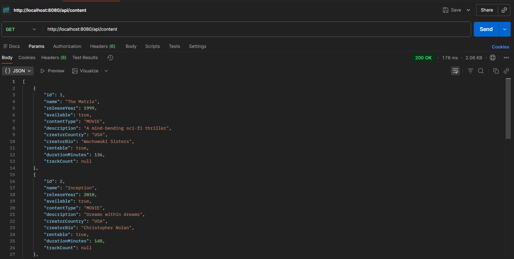
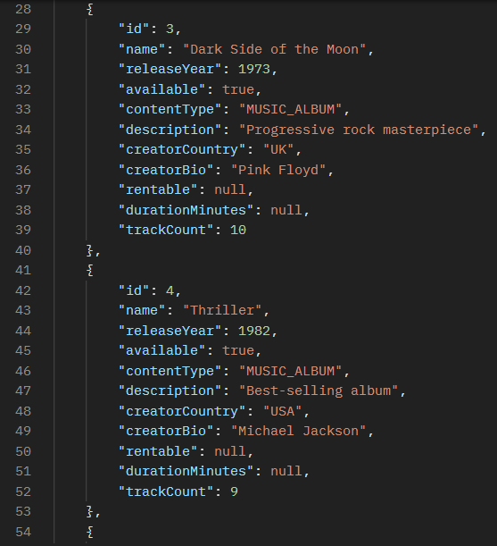
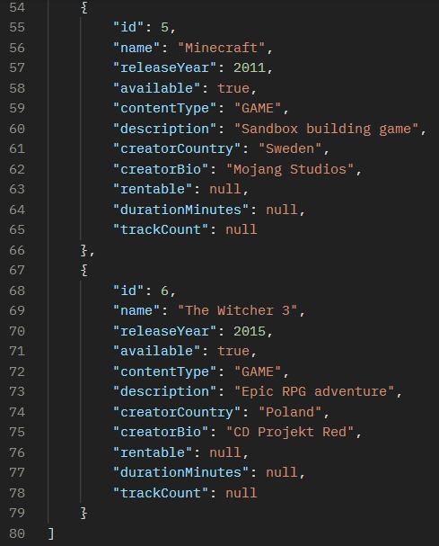
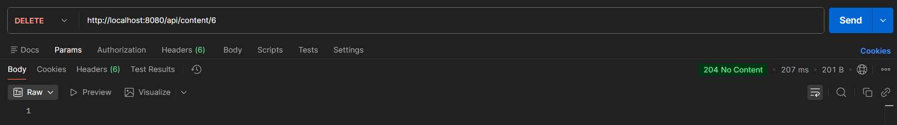
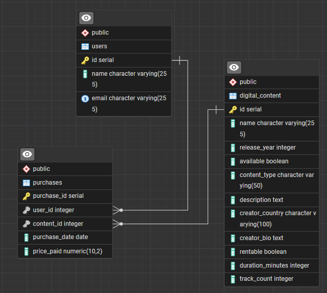
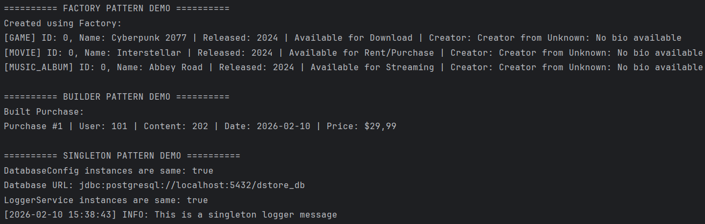
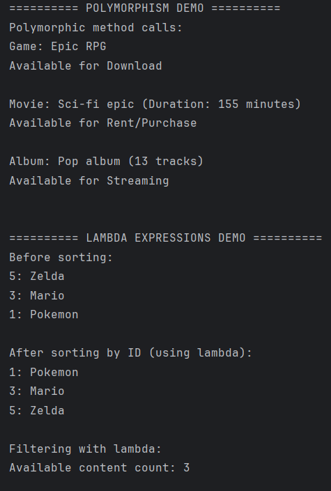
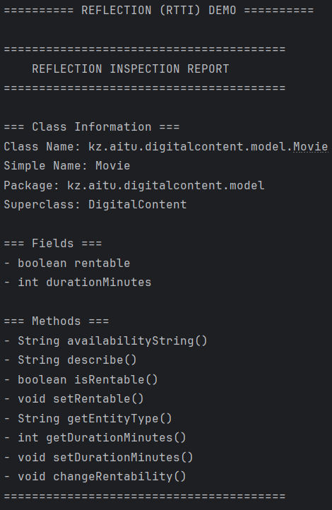
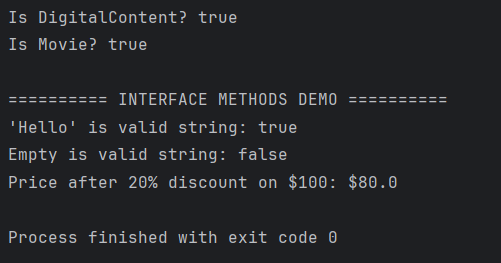

# Digital Content Platform API

**OOP Course Project - Spring Boot RESTful API with PostgreSQL**

> **Database:** This project uses **PostgreSQL**.

---

## Project Overview

A comprehensive **Digital Content Platform** that manages movies, games, music albums, users, and purchases through a professional RESTful API. This project demonstrates mastery of:

- **Object-Oriented Programming** (Inheritance, Polymorphism, Encapsulation, Abstraction)
- **SOLID Principles** (SRP, OCP, LSP, ISP, DIP)
- **Design Patterns** (Singleton, Factory, Builder)
- **Component Principles** (REP, CCP, CRP)
- **Advanced Java Features** (Generics, Lambdas, Reflection, Interfaces with default/static methods)
- **Spring Boot REST API** with clean architecture
- **JDBC Database Access** with proper exception handling

---

## System Architecture

```
┌─────────────────────────────────────────────┐
│          REST API Layer (Controllers)       │
│  - DigitalContentController                 │
│  - UserController                           │
│  - PurchaseController                       │
└──────────────────┬──────────────────────────┘
                   │
┌──────────────────▼──────────────────────────┐
│         Service Layer (Business Logic)      │
│  - DigitalContentServiceImpl                │
│  - UserService                              │
│  - PurchaseService                          │
└──────────────────┬──────────────────────────┘
                   │
┌──────────────────▼──────────────────────────┐
│       Repository Layer (Data Access)        │
│  - DigitalContentRepository                 │
│  - UserRepository                           │
│  - PurchaseRepository                       │
└──────────────────┬──────────────────────────┘
                   │
┌──────────────────▼──────────────────────────┐
│            Database (SQLite)                │
│  - digital_content                          │
│  - users                                    │
│  - purchases                                │
└─────────────────────────────────────────────┘
```

---

## Design Patterns Implementation

### 1. **Singleton Pattern**

**Purpose:** Ensure single instance of critical resources

**Implementation:**
- `DatabaseConfig` - Single database configuration instance
- `LoggerService` - Centralized logging service

**Code Example:**
```java
DatabaseConfig config = DatabaseConfig.getInstance();
LoggerService logger = LoggerService.getInstance();
```

**Why Singleton?** Prevents multiple database connections and ensures consistent configuration across the application.

---

### 2. **Factory Pattern**

**Purpose:** Create subclasses without exposing creation logic

**Implementation:**
- `DigitalContentFactory` - Creates Game, Movie, or MusicAlbum instances

**Code Example:**
```java
DigitalContent game = DigitalContentFactory.createContent("GAME", "Minecraft");
DigitalContent movie = DigitalContentFactory.createMovie(1, "Inception", ...);
```

**Why Factory?** Follows **Open-Closed Principle (OCP)** - new content types can be added without modifying existing code.

---

### 3. **Builder Pattern**

**Purpose:** Construct complex objects with many parameters

**Implementation:**
- `PurchaseBuilder` - Builds Purchase objects with fluent API

**Code Example:**
```java
Purchase purchase = PurchaseBuilder.newPurchase()
        .userId(1)
        .contentId(5)
        .pricePaid(29.99)
        .purchaseDate(LocalDate.now())
        .build();
```

**Why Builder?** Improves readability and handles optional parameters elegantly.

---

## Component Principles

### **REP (Reuse/Release Equivalence Principle)**
Reusable modules are organized in packages:
- `patterns/` - Design pattern implementations
- `utils/` - Utility classes (SortingUtils, ReflectionUtils)
- `repository/interfaces/` - Generic CRUD interface

### **CCP (Common Closure Principle)**
Classes that change together are grouped:
- All repositories in `repository/`
- All services in `service/`
- All controllers in `controller/`

### **CRP (Common Reuse Principle)**
No unnecessary dependencies:
- Controllers don't depend on repositories (only services)
- Services don't contain presentation logic
- Repositories don't contain business logic

---

## SOLID Principles

### **S - Single Responsibility Principle (SRP)**
Each class has ONE reason to change:
- `DigitalContentRepository` - **ONLY** data access
- `DigitalContentServiceImpl` - **ONLY** business logic
- `DigitalContentController` - **ONLY** HTTP handling

### **O - Open/Closed Principle (OCP)**
Open for extension, closed for modification:
- `DigitalContent` is abstract - new types can extend it
- `DigitalContentFactory` supports adding new types without changing existing code

### **L - Liskov Substitution Principle (LSP)**
Subclasses can replace parent classes:
```java
DigitalContent content = new Movie(...);
        content.displayInfo(); // Works correctly
content = new Game(...);
content.displayInfo(); // Also works correctly
```

### **I - Interface Segregation Principle (ISP)**
Small, focused interfaces:
- `Validatable` - Only validation methods
- `PricedItem` - Only pricing methods
- `CrudRepository<T>` - Generic CRUD operations

### **D - Dependency Inversion Principle (DIP)**
Depend on abstractions, not concrete classes:
```java
public class DigitalContentServiceImpl implements DigitalContentService {
   private final DigitalContentRepository repository; // Depends on interface

   @Autowired
   public DigitalContentServiceImpl(DigitalContentRepository repository) {
      this.repository = repository; // Dependency injection
   }
}
```

---

## Advanced OOP Features

### **1. Generics**
```java
public interface CrudRepository<T> {
   T create(T entity);
   List<T> getAll();
   Optional<T> getById(int id);
}
```

### **2. Lambda Expressions**
```java
// Sorting with lambda
entities.sort((e1, e2) -> Integer.compare(e1.getId(), e2.getId()));

// Filtering with lambda
        contents.stream().filter(c -> c.isAvailable()).collect(Collectors.toList());
```

### **3. Reflection (RTTI)**
```java
String inspection = ReflectionUtils.inspectObject(movie);
// Outputs: class name, fields, methods
```

### **4. Interface Default & Static Methods**
```java
public interface Validatable {
   void validate(); // Abstract

   default String getValidationMessage(String field, String issue) {
      return String.format("Validation Error [%s]: %s", field, issue);
   }

   static boolean isValidString(String value) {
      return value != null && !value.trim().isEmpty();
   }
}
```

---

## Database Schema

**PostgreSQL Database: `digitalcontent`**

### **Tables**

#### **users**
| Column | Type         | Constraints       |
|--------|--------------|-------------------|
| id     | SERIAL       | PRIMARY KEY       |
| name   | VARCHAR(255) | NOT NULL          |
| email  | VARCHAR(255) | UNIQUE, NOT NULL  |

#### **digital_content**
| Column           | Type         | Constraints         |
|------------------|--------------|---------------------|
| id               | SERIAL       | PRIMARY KEY         |
| name             | VARCHAR(255) | NOT NULL            |
| release_year     | INTEGER      | NOT NULL            |
| available        | BOOLEAN      | NOT NULL            |
| content_type     | VARCHAR(50)  | NOT NULL, CHECK     |
| description      | TEXT         |                     |
| creator_country  | VARCHAR(100) |                     |
| creator_bio      | TEXT         |                     |
| rentable         | BOOLEAN      | (Movie only)        |
| duration_minutes | INTEGER      | (Movie only)        |
| track_count      | INTEGER      | (Album only)        |

#### **purchases**
| Column        | Type          | Constraints       |
|---------------|---------------|-------------------|
| purchase_id   | SERIAL        | PRIMARY KEY       |
| user_id       | INTEGER       | FOREIGN KEY       |
| content_id    | INTEGER       | FOREIGN KEY       |
| purchase_date | DATE          | NOT NULL          |
| price_paid    | DECIMAL(10,2) | NOT NULL          |

---

## REST API Endpoints

### **Digital Content Endpoints**

| Method | Endpoint                     | Description              |
|--------|------------------------------|--------------------------|
| GET    | `/api/content`               | Get all content          |
| GET    | `/api/content/{id}`          | Get content by ID        |
| POST   | `/api/content`               | Create new content       |
| PUT    | `/api/content/{id}`          | Update content           |
| DELETE | `/api/content/{id}`          | Delete content           |
| GET    | `/api/content/search?keyword=` | Search by name         |
| GET    | `/api/content/available`     | Get available content    |

### **User Endpoints**

| Method | Endpoint           | Description       |
|--------|--------------------|-------------------|
| GET    | `/api/users`       | Get all users     |
| GET    | `/api/users/{id}`  | Get user by ID    |
| POST   | `/api/users`       | Create new user   |
| PUT    | `/api/users/{id}`  | Update user       |
| DELETE | `/api/users/{id}`  | Delete user       |

### **Purchase Endpoints**

| Method | Endpoint                      | Description              |
|--------|-------------------------------|--------------------------|
| GET    | `/api/purchases`              | Get all purchases        |
| GET    | `/api/purchases/{id}`         | Get purchase by ID       |
| GET    | `/api/purchases/user/{userId}`| Get user's purchases     |
| POST   | `/api/purchases`              | Create new purchase      |
| DELETE | `/api/purchases/{id}`         | Delete purchase          |

---

## Sample API Requests

### **Create Movie**
```bash
POST http://localhost:8080/api/content
Content-Type: application/json

{
  "name": "Inception",
  "releaseYear": 2010,
  "available": true,
  "contentType": "MOVIE",
  "description": "Mind-bending thriller",
  "creatorCountry": "USA",
  "creatorBio": "Christopher Nolan",
  "rentable": true,
  "durationMinutes": 148
}
```

### **Create User**
```bash
POST http://localhost:8080/api/users
Content-Type: application/json

{
  "name": "John Doe",
  "email": "john@example.com"
}
```

### **Create Purchase**
```bash
POST http://localhost:8080/api/purchases
Content-Type: application/json

{
  "userId": 1,
  "contentId": 1,
  "purchaseDate": "2024-02-10",
  "pricePaid": 14.99
}
```

### **Search Content**
```bash
GET http://localhost:8080/api/content/search?keyword=inception
```

---

## How to Run

### **Prerequisites**
- Java 17 or higher
- Maven 3.6+
- PostgreSQL 12+ (installed and running)

### **Steps**

1. **Set up PostgreSQL database**
```bash
# Create database (in psql or pgAdmin)
CREATE DATABASE digitalcontent;

# Default credentials (update in DatabaseConfig.java if different):
# Username: postgres
# Password: postgres
# Port: 5432
```

2. **Clone the repository**
```bash
git clone <your-repo-url>
cd digital-content-platform-api
```

3. **Configure database connection (if needed)**

Edit `src/main/java/kz/aitu/digitalcontent/patterns/DatabaseConfig.java`:
```java
this.url = "jdbc:postgresql://localhost:5432/digitalcontent";
        this.username = "your_username";
        this.password = "your_password";
```

4. **Build the project**
```bash
mvn clean install
```

5. **Run the application**
```bash
mvn spring-boot:run
```

The application will automatically create tables and insert sample data on first run.

6. **Access the API**
```
Server: http://localhost:8080
Test endpoint: http://localhost:8080/api/content
```

7. **Run OOP Demo (Optional)**
```bash
java -cp target/classes kz.aitu.digitalcontent.OOPFeaturesDemo
```

---

## Testing with Postman

1. Import the Postman collection (if provided)
2. Test each endpoint:
   - Create content
   - Get all content
   - Update content
   - Delete content
   - Search functionality

---

## Project Structure

```
digital-content-platform-api/
├── src/main/java/kz/aitu/digitalcontent/
│   ├── controller/           # REST Controllers
│   │   ├── DigitalContentController.java
│   │   ├── UserController.java
│   │   └── PurchaseController.java
│   ├── service/              # Business Logic
│   │   ├── interfaces/
│   │   │   └── DigitalContentService.java
│   │   ├── DigitalContentServiceImpl.java
│   │   ├── UserService.java
│   │   └── PurchaseService.java
│   ├── repository/           # Data Access
│   │   ├── interfaces/
│   │   │   └── CrudRepository.java
│   │   ├── DigitalContentRepository.java
│   │   ├── UserRepository.java
│   │   └── PurchaseRepository.java
│   ├── model/                # Domain Entities
│   │   ├── BaseEntity.java
│   │   ├── DigitalContent.java
│   │   ├── Game.java
│   │   ├── Movie.java
│   │   ├── MusicAlbum.java
│   │   ├── User.java
│   │   ├── Purchase.java
│   │   ├── Creator.java
│   │   ├── Validatable.java
│   │   └── PricedItem.java
│   ├── dto/                  # Data Transfer Objects
│   │   └── DigitalContentDTO.java
│   ├── exception/            # Custom Exceptions
│   │   ├── InvalidInputException.java
│   │   ├── DuplicateResourceException.java
│   │   ├── ResourceNotFoundException.java
│   │   ├── DatabaseOperationException.java
│   │   └── GlobalExceptionHandler.java
│   ├── patterns/             # Design Patterns
│   │   ├── DatabaseConfig.java
│   │   ├── LoggerService.java
│   │   ├── DigitalContentFactory.java
│   │   └── PurchaseBuilder.java
│   ├── utils/                # Utilities
│   │   ├── DatabaseInitializer.java
│   │   ├── SortingUtils.java
│   │   └── ReflectionUtils.java
│   ├── Application.java      # Main Spring Boot App
│   └── OOPFeaturesDemo.java  # OOP Demo
├── src/main/resources/
│   └── application.properties
├── pom.xml
└── README.md
```

---

## 🎓 Learning Outcomes

Through this project, I have mastered:

**OOP Principles:** Inheritance, polymorphism, encapsulation, abstraction  
**SOLID Architecture:** Clean, maintainable, scalable code  
**Design Patterns:** Singleton, Factory, Builder  
**Advanced Java:** Generics, lambdas, reflection, interface enhancements  
**REST API Design:** Professional endpoint structure  
**Spring Boot:** Modern Java web framework  
**JDBC:** Database access with PreparedStatements  
**Exception Handling:** Custom hierarchy with global handler  
**Component Principles:** REP, CCP, CRP   
**Professional Documentation:** Clear, comprehensive README

---

## Reflection

### **What I Learned**
- How to structure a professional Spring Boot application
- The importance of SOLID principles in maintainable code
- How design patterns solve real-world problems
- The power of dependency injection for loose coupling

### **Challenges Faced**
- Mapping polymorphic entities to/from database
- Implementing generic repository with JDBC
- Balancing DTO usage vs direct entity exposure

### **Benefits Realized**
- **Testability:** Each layer can be tested independently
- **Flexibility:** Easy to swap implementations (e.g., repository)
- **Scalability:** Clean architecture supports growth
- **Maintainability:** Clear separation of concerns

---

## Screenshots

### API Testing with Postman





### Database Structure


### Successful CRUD Operations



