# Digital Store API (JDBC, OOP, Multi-layer Architecture)
## Project Overview
### Purpose of the API

This project is a console-based Digital Store API implemented in Java using JDBC and a layered architecture.
The goal of the project is to demonstrate:

* Object-Oriented Programming principles

* Clean separation of layers (Controller → Service → Repository)

* CRUD operations using JDBC

* Validation and business rules

* Polymorphism and abstraction in a real-world domain

The system simulates a digital marketplace where users can purchase different types of digital content.

### Entities and Relationships

Main entities:

* User — represents a customer

* Creator — represents a creator/author of digital content

* DigitalContent (abstract)

* * Game

* * Movie

* * MusicAlbum

* Purchase — represents a completed purchase transaction

### Relationships:

A Creator can create many digital content items

A User can purchase multiple content items

Each Purchase references exactly one User and one DigitalContent

Digital content types are stored in a single table using content_type

### OOP Design Overview

The project follows classic OOP and layered design:

Controller (Main)
<br />↓<br />
Service (Business logic, validation)
<br />↓<br />
Repository (JDBC, SQL)
<br />↓<br />
Database (PostgreSQL)


Each layer has a clear responsibility and does not break encapsulation.

## OOP Design Documentation
### Abstract Class and Subclasses
Abstract class: DigitalContent
> public abstract class DigitalContent {<br />
protected int id;<br />
protected String name;<br />
protected Creator creator;<br />
protected int releaseYear;<br />
protected boolean available;<br />
public abstract String describe();<br />
}

Subclasses:

* Game

* Movie

* MusicAlbum

#### Each subclass:

Extends DigitalContent

Adds its own fields

Implements its own describe() method

### Interfaces and Implemented Methods
#### CRUD Interface
> public interface CrudRepository<T> {<br />
void create(T entity);<br />
List<T> getAll();<br />
T getById(Integer id);<br />
void update(Integer id, T entity);<br />
void delete(Integer id);<br />
}


#### Implemented by:

* UserRepository

* CreatorRepository

* GameRepository

* MovieRepository

* MusicAlbumRepository

#### Validation Interface
> public interface Validate {<br />
void validate();<br />
}

#### Implemented by:

* User

* Creator

* Purchase

* Digital content entities

### Composition and Aggregation

DigitalContent has a Creator (aggregation)

Purchase references User and DigitalContent by ID

Service layer composes multiple repositories

### Polymorphism Examples
> DigitalContent content = movieService.getMovieById(id);<br />
System.out.println(content.describe());


Different subclasses produce different behavior through the same interface.

### Exception Hierarchy
```
InvalidInputException (base)
  └── DuplicateResourceException
ResourceNotFoundException
DatabaseOperationException
```

### UML Diagram

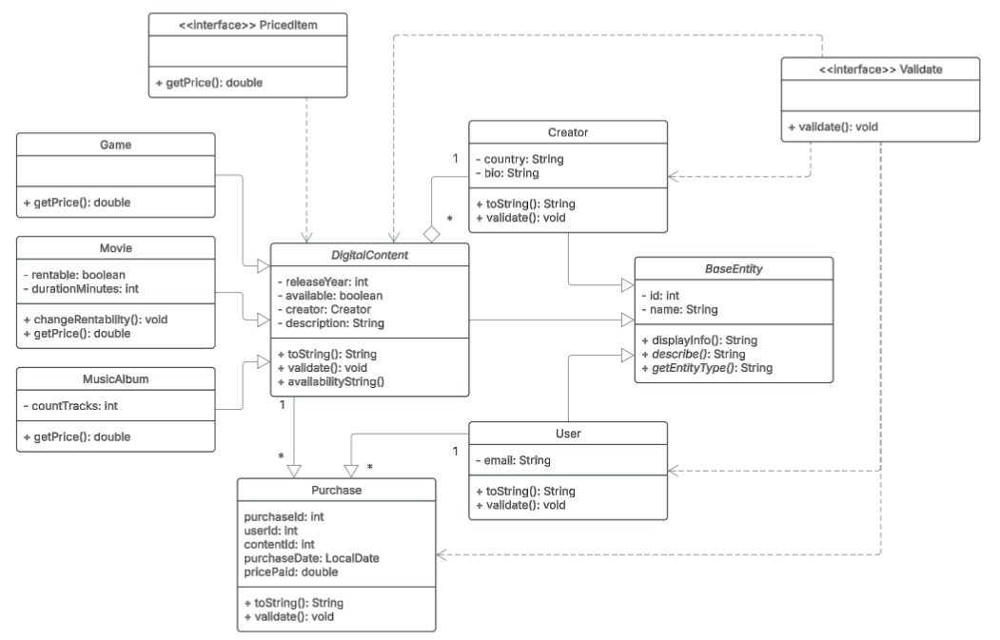

## Database Description
### Schema Overview

#### Main tables:
* users

* creators

* content

* purchases

#### Constraints and Foreign Keys

* content.creator_id → creators.id

* purchases.user_id → users.id

* purchases.content_id → content.id

* Unique constraint on (user_id, content_id) in purchases

* NOT NULL constraints for all required fields

#### Sample SQL Inserts
> INSERT INTO creators (name, country, bio)
VALUES ('Eric Barone', 'USA', 'Indie game developer');

> INSERT INTO users (name, email)
VALUES ('Yelena', 'yelena@mail.com');

## Controller (CLI Demonstration)

The controller layer is implemented in Main and demonstrates:

* Creating entities

* Reading data from database

* Updating entities

* Deleting entities with validation

* Triggering validation and business rule exceptions

* Polymorphism via abstract methods

* Interface-based method calls

#### Example Output
--- CREATE ---<br />
Creator created successfully<br />
Game created successfully<br />
Purchase completed<br />

--- READ ---<br />
User ID: 1 | Name: Yelena | Email: yelena@mail.com

--- VALIDATION ---<br />
Content already purchased

## Instructions to Compile and Run
#### Requirements

* Java 17+

* PostgreSQL

* JDBC Driver

* IntelliJ IDEA (recommended)

### Compile and Run
javac -d out src/**/*.java <br />
java -cp out Main


Or simply run Main from IntelliJ IDEA.

## Screenshots

Screenshots included in /screenshots folder:

Successful CRUD operations<br />
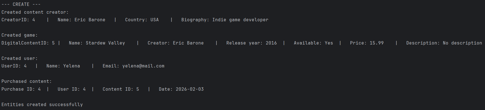
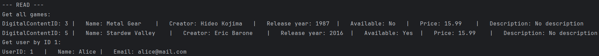
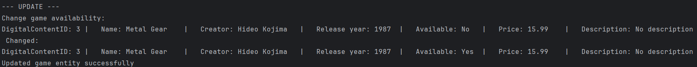
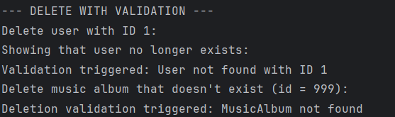

Validation <br />
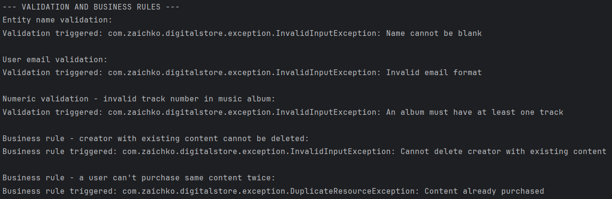

Polymorphism through describe()<br />
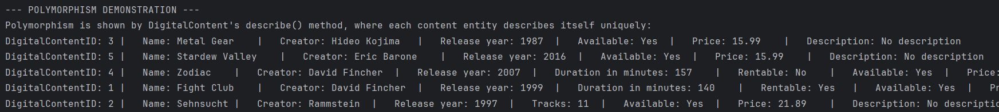

Additional method: Show top creator<br />
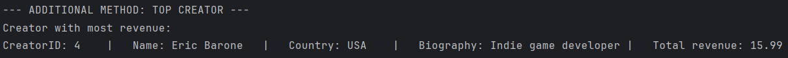

Database state before and after operations<br />
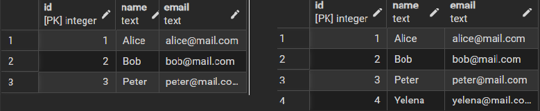<br />
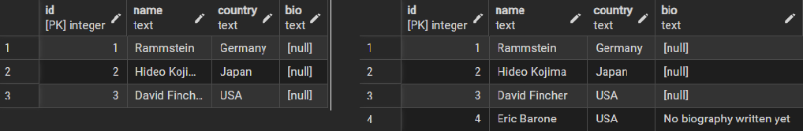<br />
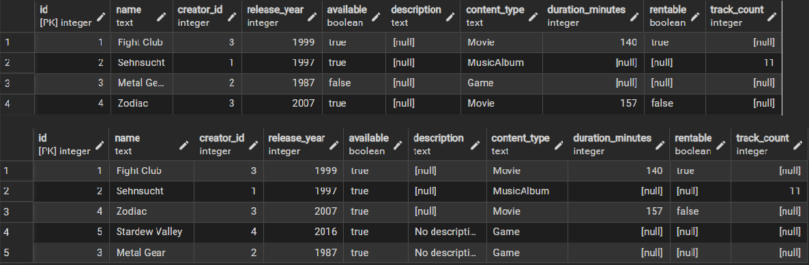<br />
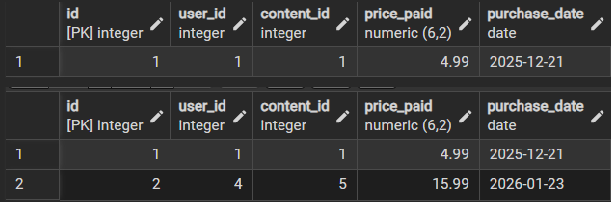<br />

## Reflection
#### What I Learned

* How to design a clean multi-layer architecture

* Practical usage of JDBC with PreparedStatements

* How abstraction and polymorphism simplify system design

* How services enforce business rules independently of storage

#### Challenges Faced

* Managing entity relationships without ORM
* Handling generated keys correctly in JDBC
* Maintaining strict separation of layers 

#### Benefits of JDBC and Multi-layer Design
* Full control over SQL and database structure

* Clear responsibility separation

* Easy testing and debugging

* Scalable architecture for future extensions